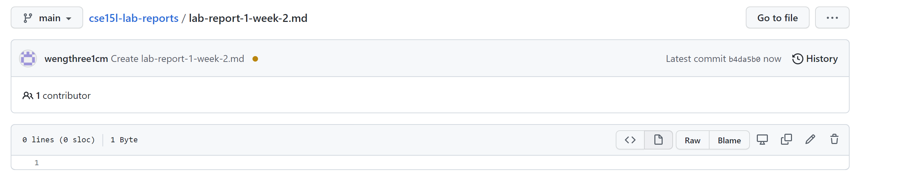

# Hello World!

## Hello smaller 


**bold**

*italic*

1. first
1. second 
1. third 
1. fourth

[link](https://github.com/wengthree1cm/cse15l-lab-reports/edit/main/index.md）

<<<<<<< HEAD

=======

>>>>>>> 86bc2b73f71d58f4d15e8eec791582ad252aa334

> Blockquote

* List
* List
* List

Horizontal rule:

---

`Inline code` with backticks

```
# code block
print '3 backticks or'
print 'indent 4 spaces'
changes
```
