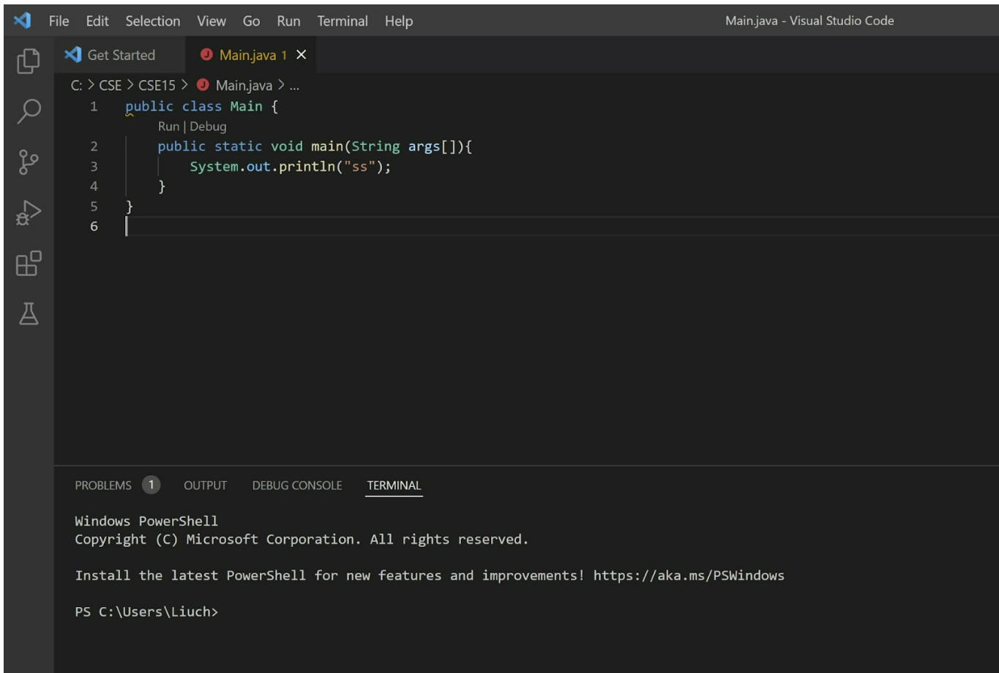
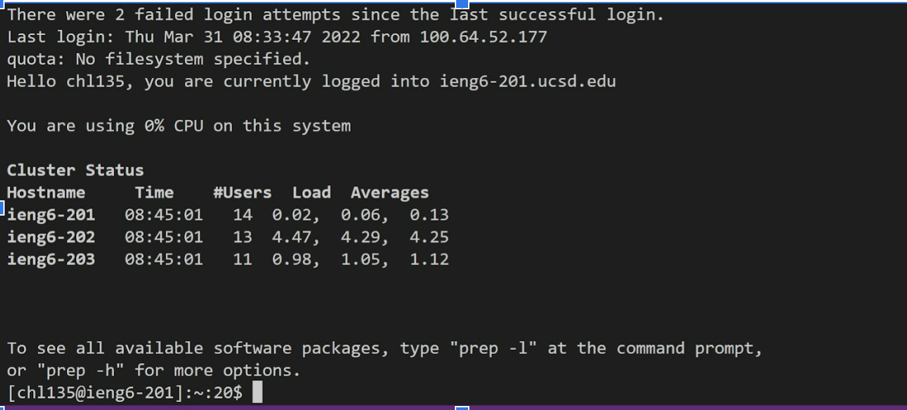
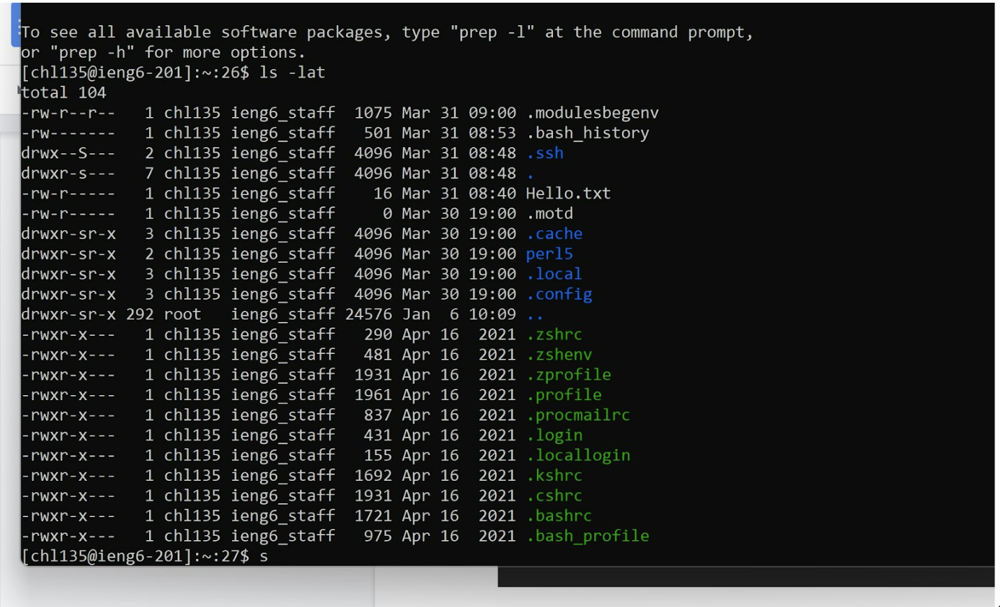
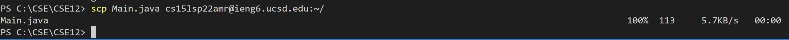
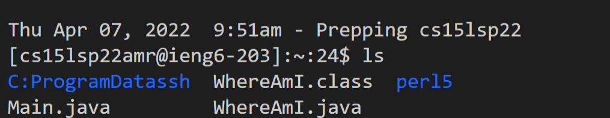
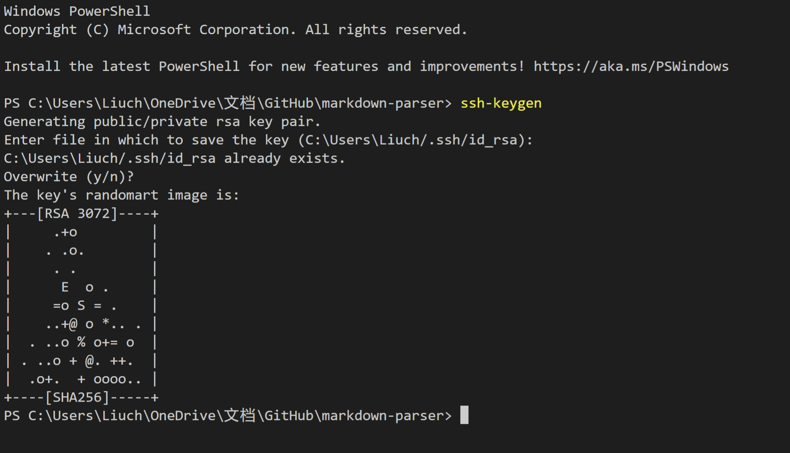
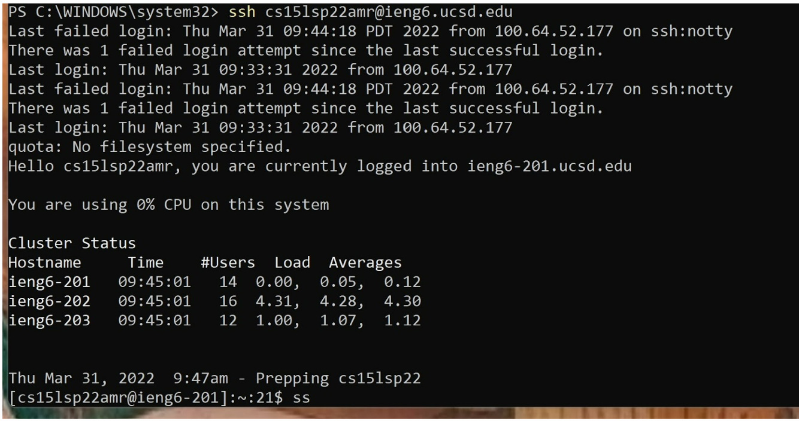

# Installing VScode

After downloading the Visual Studio Code
[Link](https://code.visualstudio.com/)
open a new java file and write the following command. 

In the terminal, use cd to change the directory to your file and input  `javac yourfilename.java` and then `java yourfilename` to run the file.

&nbsp;  
&nbsp;  
# Remotely Connecting

Find your username on the UCSD website, 
enter `ssh username@ieng6.ucsd.edu` in terminal and you should be asked for password. 

After entering password, you should see the following result. 

&nbsp;  
&nbsp;  
# Trying Some Commands

Try running the commands 
* cd
* ls
* pwd
* mkdir
* cp 
see what comes up. 

&nbsp;  
&nbsp;  
# Moving Files with scp

Remember the file you created in step one, use `scp yourfilename.java username@ieng6.ucsd.edu:~/` to copy your file.  

you should see the following result in terminal



And then login in to ssh and use `ls`, you should see your file!!


&nbsp;  
&nbsp;  
# Setting an SSH Key

Enter following command one by one

Here is what you should enter in terminal

```
$ ssh-keygen  

Generating public/private rsa key pair.  

Enter file in which to save the key (/Users/<user-name>/.ssh/id_rsa): /Users/<user-name>/.ssh/id_rsa
Enter passphrase (empty for no passphrase): 
```
you do not need to enter any passphrases.

```
Enter same passphrase again: 
Your identification has been saved in /Users/<user-name>/.ssh/id_rsa.
Your public key has been saved in /Users/<user-name>/.ssh/id_rsa.pub.
The key fingerprint is:
SHA256:jZaZH6fI8E2I1D35hnvGeBePQ4ELOf2Ge+G0XknoXp0 <user-name>@<system>.local
The key's randomart image is:
+---[RSA 3072]----+
|                 |
|       . . + .   |
|      . . B o .  |
|     . . B * +.. |
|      o S = *.B. |
|       = = O.*.*+|
|        + * *.BE+|
|           +.+.o |
|             ..  |
+----[SHA256]-----+
```

If you are on windows you need to follow these [extra steps](https://docs.microsoft.com/en-us/windows-server/administration/openssh/openssh_keymanagement#user-key-generation).

now copy the key to your ssh directory with the following method
we can use `exit` to logout

```
$ ssh cs15lsp22zz@ieng6.ucsd.edu
<Enter Password>

$ mkdir .ssh
$ <logout> 
#you need to do the following locally
$ scp /Users/<user-name>/.ssh/id_rsa.pub cs15lsp22zz@ieng6.ucsd.edu:~/.ssh/authorized_keys

```
Then you can login without password.

&nbsp;  
&nbsp; 
# Optimizing Remote Running

First, finishing editing your file locally.

And then use `"scp File name cse15lsp22amr@ieng6.ucsd.edu~/"` to copy  the file to the servefr

And then use `"ssh cse15lsp22amr@ieng6.ucsd.edu "javac filename""` to compile the code

And then use `"ssh cse15lsp22amr@ieng6.ucsd.edu
"java filename""` to run the file
ss

ss


